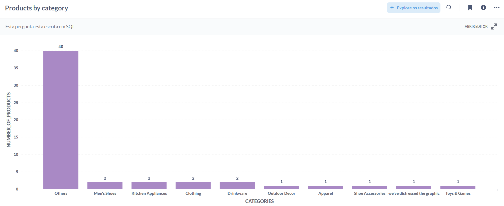
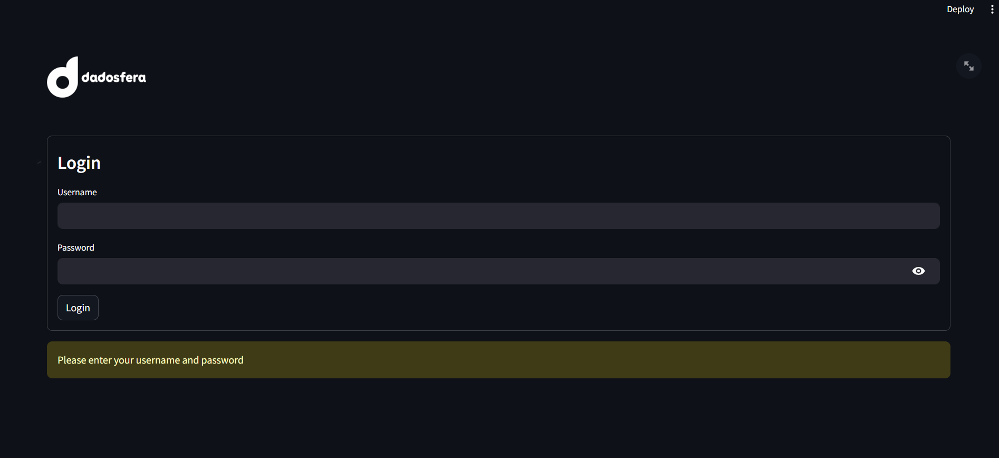

## Item 1
Nessa etapa foi gravado um vídeo fornecendo uma solução técnica para uma empresa fictícia. O vídeo pode ser acessado no seguite [link](https://youtu.be/oyy6MwAZTgM).

## Item 2
Nessa etapa criou-se um pipeline para ingestão e catalogação do dataset, o qual pode ser acessado no seguinte [link](https://app.dadosfera.ai/pt-BR/collect/pipelines/67db9cfb-25c4-4abd-a03d-e9b6977136b9).

## Item 3
Nessa etapa foi usada a API da OpenAI para determinar as *features* de cada produto. O código utilizado está neste repositório. Para acessá-lo basta acessar a pasta **item_3**.
Vale ressaltar que, por conta de segurança, não foi incluido o .env com as chaves de acesso da API.

## Item 4
Nessa etapa fez-se a análise da quantidade de produtos por categoria. A coleção com a query requisitada pode ser acessada no seguinte [link](https://metabase-treinamentos.dadosfera.ai/collection/302-vinicius-yuji-122023).
O resultado obtido foi este:

Pode-se observar que muitos produtos ficaram na classificação **Others**, ou seja, não tiveram sua classificação determinada pela API da OpenAI.

## Item 5
Inicialmente o data app do item 5 foi feito localmente. Os arquivos estão neste repositório, dentro da pasta **item_5**. 
Foi feita uma tela inicial de login, na qual se pode logar com as seguintes credenciais:
- Username: dadosfera
- Password: dadosfera

Uma vez logado, no menu esquerdo, pode-se selecionar a coluna do dataset com a qual se deseja fazer a análise. Feito isso, será plotado um *Word Embedding Chart* com os dados da coluna escolhida:

Em seguida foi realizado o deploy do data app na Dadosfera. Para acessá-lo, basta clicar neste [link](https://app-intelligence-treinamentos.dadosfera.ai/pipeline?project_uuid=a547a8a2-62ed-4176-ba5c-aa563c8edd30&pipeline_uuid=b6518be8-0183-4c6f-baec-94f3b87fe67b).
